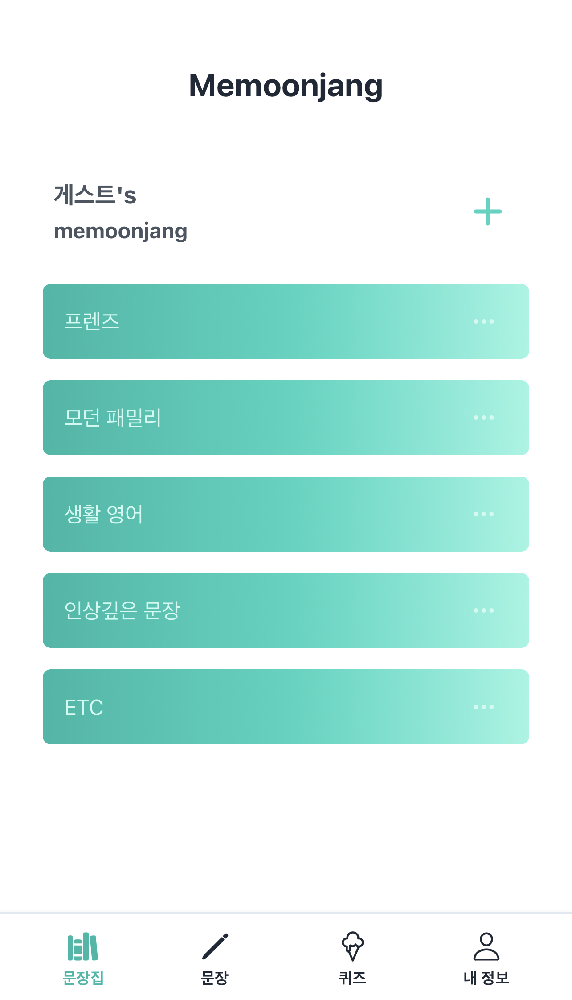
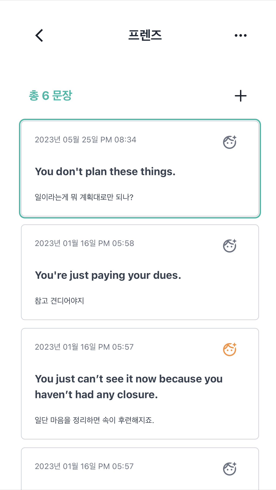

# Me-moonjang

> 영어문장을 단어장처럼 문장집으로 만들어 공부하는 앱 [Me Moonjang 📚](https://me-moonjang.vercel.app/)

> 자세한 정보는 ['포트폴리오'로 이동 📖](https://ukjae-portfolio.vercel.app/projects/memoonjang)

<br>
<p>

 &nbsp; &nbsp; &nbsp;


</p>

<br>
<br>

## 🎙️ Description

영어문장으로 영어공부를 하는 영어학습 어플리케이션입니다.
<br><br>
'영어단어 앱은 많은데 왜 영어문장을 학습하는 앱은 없을까?' 라는 궁금증과 함께 영어문장으로 영어를 학습하는 것이 더 효율적이라는 생각이 맞물려 기획했습니다.

<br>

## 💡 Main Feature

### 문장 학습 기능

- 문장 등록, 이동, 삭제 기능 구현

- 문장집별 문장 모아보기

- 문장의 상세 내용 조회(영문장, 해설, 추가 설명)

  - 문장 학습을 위해 클릭시 해당 문장만 표시, 재클릭시 모든 내용 표시

### 문장집별 퀴즈

- OX 퀴즈 형태로 랜덤하게 출제

<br>

## 🖥️ Getting Started

### Installation

```sh
git clone https://github.com/Gryffindor0ne/me-moonjang.git
yarn install
```

### Develop Mode

```sh
yarn dev
```

<br>

## ⛵️ Stack

🖥️ Frontend : React, Next.js, TypeScript, TailwindCSS, React Query, Recoil <br><br>
🧺 Backend : MongoDB <br><br>
🎉 Deployment : Vercel

<br>

## 🪜 Project Structure

```
📦
├─ components
│  ├─ common
│  │  └─ LearningState.tsx
│  ├─ group
│  │  ├─ GroupHeader.tsx
│  │  ├─ GroupNavbar.tsx
│  │  ├─ SelectSentence.tsx
│  │  └─ Sentence.tsx
│  ├─ groups
│  │  ├─ GroupBoard.tsx
│  │  └─ components
│  │     ├─ Group.tsx
│  │     └─ GroupsNavbar.tsx
│  ├─ layout
│  │  ├─ Layout.tsx
│  │  ├─ Loading.tsx
│  │  ├─ LoginIndicator.tsx
│  │  ├─ Main.tsx
│  │  ├─ MainNavigation.tsx
│  │  ├─ Seo.tsx
│  │  └─ Splash.tsx
│  ├─ modals
│  │  ├─ ConfirmModal.tsx
│  │  ├─ GlobalModal.tsx
│  │  ├─ GroupEditModal.tsx
│  │  ├─ GroupNameModal.tsx
│  │  ├─ GroupSelectModal.tsx
│  │  └─ SentenceEditModal.tsx
│  └─ quiz
│     ├─ GroupBox.tsx
│     ├─ QuizBoard.tsx
│     ├─ QuizBox.tsx
│     └─ QuizResult.tsx
├─ hooks
│  ├─ useCustomToast.ts
│  └─ useModal.ts
├─ jest.config.js
├─ jest.setup.js
├─ lib
│  ├─ auth.ts
│  ├─ axiosInstance
│  │  ├─ constants.ts
│  │  └─ index.ts
│  ├─ db.ts
│  └─ jwt.ts
├─ next.config.js
├─ package.json
├─ pages
│  ├─ [groupId]
│  │  ├─ [id].tsx
│  │  └─ index.tsx
│  ├─ _app.tsx
│  ├─ _document.tsx
│  ├─ api
│  │  ├─ auth
│  │  │  ├─ [...nextauth].js
│  │  │  ├─ delete-user.ts
│  │  │  ├─ index.ts
│  │  │  ├─ login.ts
│  │  │  ├─ logout.ts
│  │  │  └─ signup.ts
│  │  ├─ groups
│  │  │  ├─ actions
│  │  │  │  └─ change-name.ts
│  │  │  ├─ detail
│  │  │  │  └─ [id].ts
│  │  │  └─ index.ts
│  │  └─ sentence
│  │     ├─ actions
│  │     │  └─ change-group.ts
│  │     ├─ index.ts
│  │     └─ learning-state.ts
│  ├─ auth
│  │  ├─ login.tsx
│  │  └─ register.tsx
│  ├─ index.tsx
│  ├─ newsentence.tsx
│  ├─ profile.tsx
│  └─ quiz
│     ├─ [groupId].tsx
│     └─ index.tsx
├─ postcss.config.js
├─ public
│  ├─ favicon.ico
│  ├─ images
│  │  └─ splash.jpeg
│  └─ vercel.svg
├─ react-query
│  ├─ constants.ts
│  ├─ hooks
│  │  ├─ group
│  │  │  ├─ useChangeGroupName.ts
│  │  │  ├─ useGroupNames.ts
│  │  │  ├─ useNewGroup.ts
│  │  │  └─ useRemoveGroup.ts
│  │  └─ sentence
│  │     ├─ useNewSentence.ts
│  │     ├─ useRemoveSentence.ts
│  │     ├─ useSentence.ts
│  │     └─ useSentenceState.ts
│  └─ queryClient.ts
├─ recoil
│  ├─ atoms
│  │  ├─ common.ts
│  │  └─ modals.ts
│  └─ selectors
│     └─ common.ts
├─ shared
│  └─ types.ts
├─ styles
│  ├─ Form.module.css
│  ├─ Indicator.module.css
│  ├─ globals.css
│  └─ styles.module.css
├─ tailwind.config.js
├─ theme
│  └─ index.ts
├─ tsconfig.json
├─ utils
│  ├─ dayjs.ts
│  ├─ factories
│  │  └─ user.factory.ts
│  ├─ makeRandomOrder.ts
│  ├─ scoreAnimation.js
│  └─ test-utils
│     ├─ index.ts
│     └─ mock-server
│        ├─ handlers.ts
│        └─ server.ts
└─ yarn.lock

```

©generated by [Project Tree Generator](https://woochanleee.github.io/project-tree-generator)

---

<br>

<p align='center'>
   
    
    
    
    
    
   
</p>
